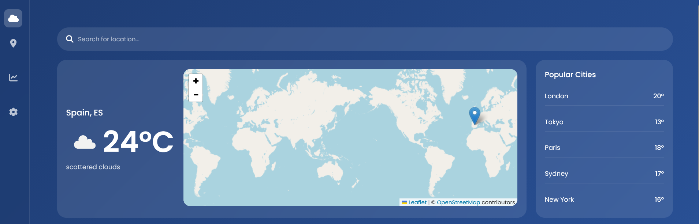
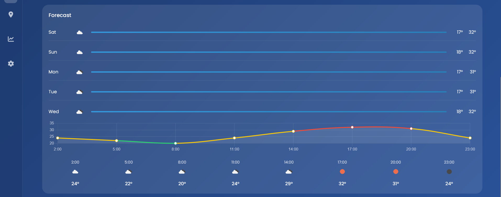
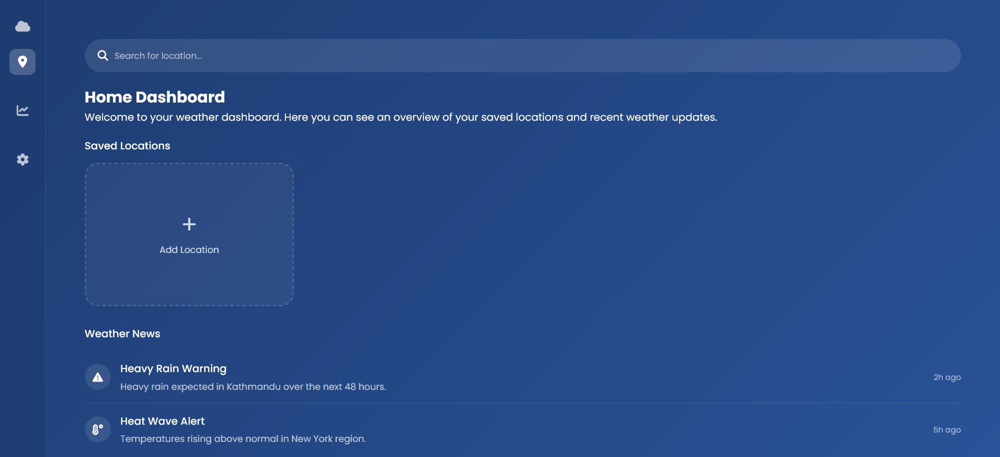
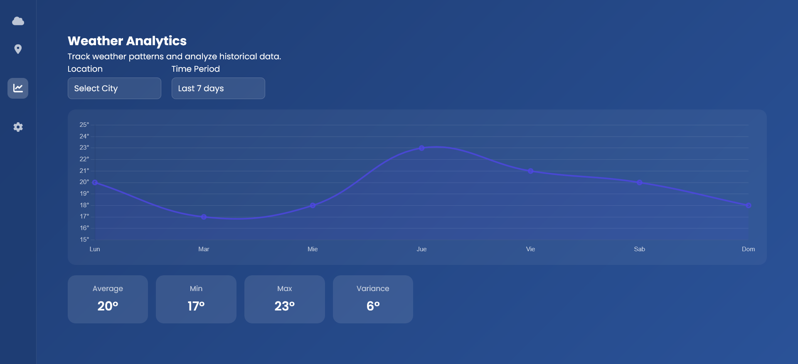
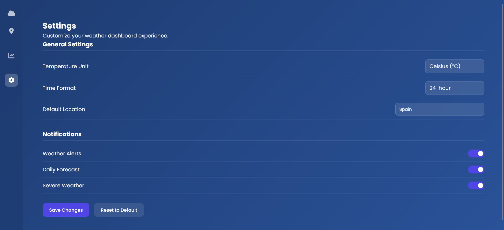
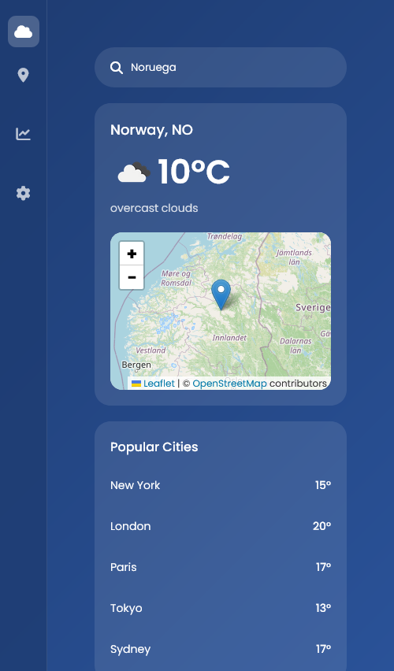

# Weather App - Aplicación Web del Clima

Aplicación web responsive del clima desarrollada con **HTML, CSS y JavaScript Vanilla**, enfocada en una interfaz limpia, organización modular y visualización de datos meteorológicos en tiempo real.

Este proyecto fue creado como práctica para mejorar habilidades de desarrollo frontend, consumo de APIs, manipulación del DOM, diseño responsive y estructuración escalable de proyectos web.

---

## Preview

### Home Dashboard — Main Overview

### Home Dashboard — Forecast & Analytics

### Saved Locations

### Weather Analytics

### Settings Panel

### Mobile Experience

---

## Características

* Aplicación meteorológica en tiempo real
* Diseño completamente responsive
* Interfaz moderna y limpia
* Búsqueda del clima por ciudad
* Renderizado dinámico de datos climáticos
* Estructura CSS modular
* Arquitectura organizada del proyecto
* Integración con API meteorológica
* Gráficas dinámicas del clima con Chart.js
* Visualización de mapas interactivos con Leaflet.js
* Solicitudes asíncronas con JavaScript
* Recursos visuales e iconos climáticos

---

## Arquitectura del Proyecto

El proyecto está organizado utilizando una estructura modular simple y escalable:

* **assets/** → Imágenes e iconos del proyecto

  * `iconos/`

    * `nube.png`
* **css/** → Estilos organizados por responsabilidad

  * `main.css`
  * `layout.css`
  * `components.css`
  * `animations.css`
  * `responsive.css`
* **js/** → Funcionalidades de la aplicación y lógica de API

  * `config.js`
  * `api.js`
  * `ui.js`
  * `main.js`
* **index.html** → Estructura principal de la aplicación

---

## Cómo Funciona

1. `index.html` contiene la estructura principal de la aplicación
2. Los estilos están separados en:

   * layouts
   * componentes
   * animaciones
   * diseño responsive
3. Los módulos JavaScript manejan:

   * configuración de la API
   * solicitudes de datos meteorológicos
   * renderizado de la interfaz
   * actualización dinámica de la información climática

4. Librerías Externas

El proyecto utiliza algunas librerías externas para mejorar la experiencia visual e interactiva:

- Chart.js → visualización de datos meteorológicos
- Leaflet.js → integración de mapas interactivos
- Font Awesome → iconografía de la interfaz
- Google Fonts → tipografía personalizada

5. `main.js` inicializa las funcionalidades principales del proyecto

---

## Diseño Responsive

La interfaz se adapta automáticamente a diferentes tamaños de pantalla:

* Desktop: dashboard completo del clima
* Tablet: contenedores y espaciados adaptativos
* Mobile: diseño optimizado para pantallas pequeñas
* Las secciones utilizan Flexbox y técnicas responsive de CSS para adaptabilidad dinámica

---

## Tecnologías Utilizadas

* HTML5
* CSS3 (Flexbox)
* JavaScript Vanilla
* Weather API
* Chart.js
* Leaflet.js
* Font Awesome
* Google Fonts (Poppins)

---

## Objetivo del Proyecto

Este proyecto fue desarrollado para practicar:

* Integración de APIs con JavaScript
* Solicitudes asíncronas y manejo de datos
* Manipulación del DOM
* Diseño web responsive
* Organización modular de CSS y JavaScript
* Integración de librerías externas como Chart.js y Leaflet.js
* Visualización dinámica de datos meteorológicos
* Estructuración profesional de proyectos frontend
* Buenas prácticas de Git y GitHub

/////////////////////////////////////////////////////////////////////////////////////////////////////////////////////////////////////////

# Weather App - Weather Forecast Website

Responsive weather application developed with **HTML, CSS, and Vanilla JavaScript**, focused on a clean interface, modular organization, and real-time weather data visualization.

This project was created as practice to improve frontend development skills, API consumption, DOM manipulation, responsive design, and scalable project structure.

---

## Preview

### Home Dashboard — Main Overview

### Home Dashboard — Forecast & Analytics

### Saved Locations

### Weather Analytics

### Settings Panel

### Mobile Experience

---

## Features

* Real-time weather application
* Fully responsive design
* Clean and modern user interface
* Weather search by city
* Dynamic weather data rendering
* Modular CSS structure
* Organized project architecture
* API integration for weather information
* Dynamic weather charts with Chart.js
* Interactive map visualization with Leaflet.js
* Asynchronous data fetching with JavaScript
* Visual weather assets and icons

---

## Project Architecture

The project is organized using a simple and scalable modular structure:

* **assets/** → Project images and icons

  * `iconos/`

    * `nube.png`
* **css/** → Styles organized by responsibility

  * `main.css`
  * `layout.css`
  * `components.css`
  * `animations.css`
  * `responsive.css`
* **js/** → Application functionalities and API logic

  * `config.js`
  * `api.js`
  * `ui.js`
  * `main.js`
* **index.html** → Main application structure

---

## How It Works

1. `index.html` contains the main structure of the application
2. Styles are separated into:

   * layouts
   * components
   * animations
   * responsive design
3. JavaScript modules handle:

   * API configuration
   * weather data requests
   * UI rendering
   * dynamic updates of weather information

4. External Libraries

The project uses several external libraries to enhance the visual and interactive experience:

Chart.js → weather data visualization
Leaflet.js → interactive map integration
Font Awesome → interface iconography
Google Fonts → custom typography

5. `main.js` initializes the main functionalities of the project

---

## Responsive Design

The interface automatically adapts to different screen sizes:

* Desktop: complete weather dashboard layout
* Tablet: adaptive containers and spacing
* Mobile: responsive layout optimized for smaller screens
* Sections use Flexbox and responsive CSS techniques for adaptability

---

## Technologies Used

* HTML5
* CSS3 (Flexbox)
* JavaScript Vanilla
* Weather API
* Chart.js
* Leaflet.js
* Font Awesome
* Google Fonts (Poppins)

---

## Project Purpose

This project was developed to practice:

* API integration with JavaScript
* Asynchronous requests and data handling
* DOM manipulation
* Responsive web design
* Modular CSS and JavaScript organization
* Dynamic visualization of meteorological data
* Professional structuring of frontend projects
* Frontend project structuring
* Good Git and GitHub practices
